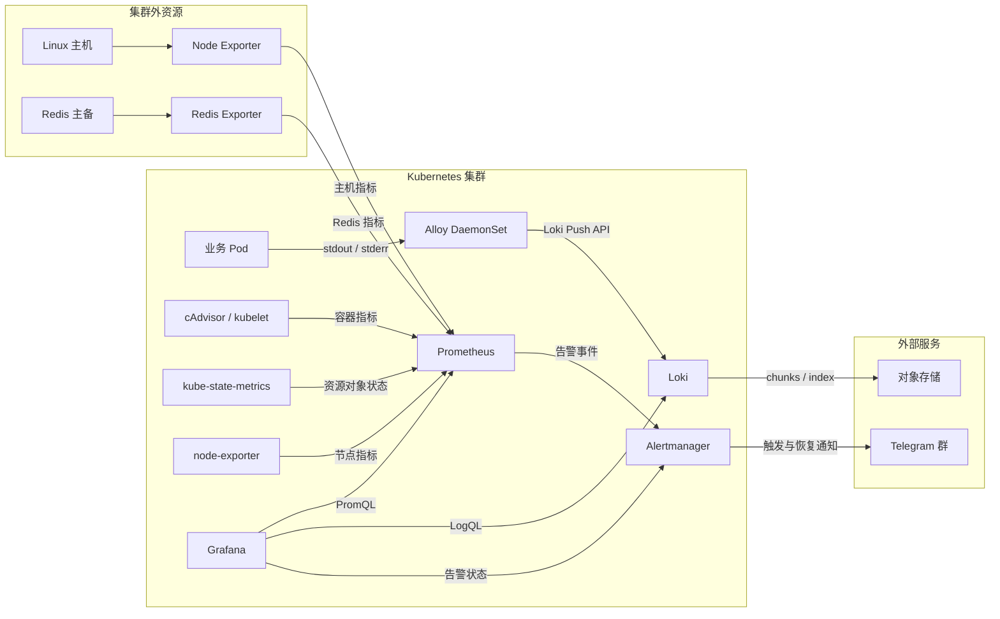

# Kubernetes 可观测平台通用部署与原理指南

## 目录

1. [建设目标](#1-建设目标)
2. [总体架构](#2-总体架构)
3. [核心原理](#3-核心原理)
4. [方案优势](#4-方案优势)
5. [部署前规划](#5-部署前规划)
6. [基础环境部署](#6-基础环境部署)
7. [外部主机与 Redis 监控](#7-外部主机与-redis-监控)
8. [Dashboard 设计规范](#8-dashboard-设计规范)
9. [Telegram 告警配置](#9-telegram-告警配置)
10. [部署后验收](#10-部署后验收)
11. [常见故障定位](#11-常见故障定位)
12. [日常运维与变更管理](#12-日常运维与变更管理)
13. [安全与治理](#13-安全与治理)
14. [适用边界与后续增强](#14-适用边界与后续增强)
15. [配置文件清单](#15-配置文件清单)

## 1. 建设目标

这套平台将指标、日志、可视化和告警组成一个闭环：

1. Prometheus 采集 Kubernetes、容器、节点、外部主机和 Redis 指标。
2. Alloy 采集 Kubernetes 容器标准输出日志，并发送到 Loki。
3. Loki 将日志索引与数据持久化到对象存储。
4. Grafana 在同一个服务页面关联指标、节点状态和实时日志。
5. Prometheus 根据规则判断异常，Alertmanager 完成聚合、抑制、路由和恢复通知。
6. Telegram 接收经过中文化和场景化处理的告警消息。

最终交付建议包含以下 Dashboard：

| Dashboard | 面向对象 | 核心内容 |
|---|---|---|
| 服务全景 | 研发、应用运维 | 副本、Pod、CPU、内存、重启、OOM、网络、关联节点、日志趋势与实时日志 |
| Kubernetes 主机监控 | 平台运维 | 节点硬件表、CPU、内存、负载、磁盘、inode、IO、网络、系统压力 |
| 非 Kubernetes 主机监控 | 系统运维 | 每台主机的容量、使用率、吞吐、错误、连接、时间同步和可用性 |
| Redis 主备监控 | 中间件运维 | 角色、复制状态、延迟、连接、内存、Key 数、淘汰、命中率、持久化 |

## 2. 总体架构



这里有两条主要数据链路：

- 指标链路采用 Pull 模型：Prometheus 定时访问各采集目标的 `/metrics`。
- 日志链路采用 Push 模型：Alloy 发现 Pod 日志后主动写入 Loki Gateway。

两条链路最终通过一致的 `cluster`、`namespace`、`service`、`pod`、`container`、`node` 等标签在 Grafana 中关联。

## 3. 核心原理

### 3.1 Prometheus 指标模型

Prometheus 将数据保存为带标签的时间序列：

```text
metric_name{label_a="value",label_b="value"} timestamp value
```

指标名描述测量对象，标签描述维度。查询时使用 PromQL 对时间序列进行过滤、聚合和计算。例如，CPU 指标本身是持续累加的 Counter，需要通过 `rate()` 计算单位时间增速：

```promql
100 - 100 * avg by (instance) (
  rate(node_cpu_seconds_total{mode="idle"}[5m])
)
```

不同采集组件关注不同层面：

| 数据源 | 回答的问题 |
|---|---|
| kube-state-metrics | Deployment 有几个副本、Pod 处于什么阶段、节点是否 Ready |
| kubelet/cAdvisor | 每个容器实际使用多少 CPU、内存、网络和文件系统资源 |
| Kubernetes node-exporter | 节点操作系统的 CPU、内存、磁盘、网络和内核状态 |
| 外部 Node Exporter | 非 Kubernetes Linux 主机的系统指标 |
| Redis Exporter | Redis 连接、内存、Key、复制、持久化及命令指标 |

Prometheus 使用 TSDB 保存近期数据，保留周期和磁盘上限应同时设置。达到时间或容量任一上限时，旧数据会被清理。

### 3.2 Loki 日志模型

Loki 不为整条日志正文建立全文索引，而是主要索引标签，将日志正文按 chunk 保存。因此它比传统全文索引方案更节省索引资源，但标签设计非常重要。

推荐使用低基数、稳定标签：

```text
cluster, namespace, service_name, workload, pod, container, node_name
```

不要把 request_id、user_id、订单号、URL 参数等高基数内容设置为 Loki 标签。这些字段应保留在日志正文中，查询时使用 `|=`、`|~` 或 JSON 解析器过滤。

典型 LogQL：

```logql
{namespace="$namespace", service_name="$service"}
  |~ "(?i)(error|exception|fatal|panic)"
```

Alloy 以 DaemonSet 运行，每个节点上的实例负责发现和采集本节点 Pod 日志。它通过 Kubernetes 元数据重标记补充查询标签，再将日志发送给 Loki。

### 3.3 Loki 对象存储与 IRSA

在 EKS 中，Loki 推荐通过 IRSA 获取访问 S3 的临时凭证：

1. Pod 使用指定 Kubernetes ServiceAccount。
2. ServiceAccount 注解绑定 IAM Role。
3. AWS STS 根据 EKS OIDC Token 校验 `aud` 和 `sub`。
4. 校验通过后签发短期凭证。
5. Loki 使用临时凭证访问指定 Bucket。

这样不需要把 Access Key 写入 Secret、Helm values 或容器环境变量。IAM Policy 只授予指定 Bucket 的列举和对象读写权限，符合最小权限原则。

### 3.4 Grafana 关联查询

Grafana 本身不是主要数据存储。它分别访问 Prometheus、Loki 和 Alertmanager，并使用 Dashboard 变量把三类数据关联起来。

服务全景页建议按以下顺序定位问题：

```text
选择命名空间与服务
        ↓
确认副本、重启、CPU、内存、OOM
        ↓
查看承载 Pod 的节点是否存在资源压力
        ↓
在同一时间范围检查错误日志和上下文
```

这种设计避免在多个 Dashboard 和系统之间反复跳转，也能减少“看到资源异常但找不到对应日志”的排障断点。

### 3.5 告警生命周期

告警链路分为两个阶段：

1. Prometheus 定期计算 PrometheusRule 中的表达式。
2. 表达式持续满足 `for` 时长后，状态从 Pending 变为 Firing。
3. Prometheus 将告警发送到 Alertmanager。
4. Alertmanager 按标签分组、抑制低级别重复告警并选择 Receiver。
5. Telegram Receiver 渲染中文模板并发送通知。
6. 指标恢复后，Alertmanager 发送 Resolved 消息。

关键参数：

| 参数 | 作用 | 常用建议 |
|---|---|---|
| `for` | 异常持续多久才告警 | 容量类 5～15 分钟；不可用类 1～3 分钟 |
| `group_wait` | 首条告警等待聚合的时间 | 30 秒左右 |
| `group_interval` | 同组告警变化后的发送间隔 | 5 分钟左右 |
| `repeat_interval` | 未恢复告警重复提醒间隔 | 4～12 小时，按严重程度调整 |
| `send_resolved` | 是否发送恢复通知 | 建议开启 |

`for` 是抑制瞬时毛刺的第一道机制；Alertmanager 的分组和抑制是减少消息风暴的第二道机制。

## 4. 方案优势

### 4.1 一个页面完成服务排障

服务 Dashboard 同时展示工作负载健康度、Pod 资源、关联节点指标和日志。时间范围统一，指标峰值与日志异常可以直接对照。

### 4.2 Kubernetes 与传统主机统一监控

集群节点和非 K8s 主机最终都转换为 Prometheus 时间序列。统一的 `host_ip`、`source`、`environment` 标签使同一套面板和告警规则可以跨环境复用。

### 4.3 存储成本可控

Prometheus 本地持久卷负责高效保存指标；Loki 将日志正文放入对象存储，只对标签建立索引。指标和日志分别使用适合自身访问模式的存储。

### 4.4 告警可读、可行动

告警消息不是简单转发原始标签，而是输出中文状态、级别、对象、时间、持续时长、摘要和处理建议。主机、Redis、Kubernetes 使用不同处置提示。

### 4.5 凭据不进入配置仓库

Loki 使用 IRSA，Telegram 和 Grafana 使用 Kubernetes Secret。模板、规则和 Dashboard 可以纳入 Git，凭据单独管理。

### 4.6 声明式、可回滚

组件由 Helm values 管理，Dashboard 由 ConfigMap 管理，告警由 PrometheusRule 管理。变更可审查、可重复部署，并可通过 Helm revision 回滚。

## 5. 部署前规划

### 5.1 推荐资源规划

以下为中小规模环境的起点，必须根据活跃序列、日志写入量、查询并发和保留周期压测调整：

| 组件 | 副本建议 | 持久化 | 主要扩容依据 |
|---|---:|---|---|
| Prometheus | 1；高可用可部署 2 | gp3/EBS | 活跃序列数、采样频率、保留期 |
| Alertmanager | 1～3 | 小容量 PVC | 告警量和高可用要求 |
| Loki write | 3 | WAL/PVC | 日志写入吞吐 |
| Loki read | 2～3 | 通常无状态 | 查询并发和查询范围 |
| Loki backend | 2～3 | PVC | compactor、index gateway 等负载 |
| Loki gateway | 2+ | 无状态 | 写入与查询请求量 |
| Alloy | 每节点 1 个 | 主机日志位置 | 节点数量和单节点日志量 |
| Grafana | 1；共享数据库后可扩展 | PVC | 用户量和 Dashboard 查询量 |

### 5.2 网络要求

- Prometheus 能访问 Kubernetes 采集目标。
- Prometheus 能访问外部主机 TCP `9100` 和 Redis Exporter TCP `9121`。
- 外部 Exporter 端口只允许 Prometheus 所在节点或安全组访问。
- Alloy 能访问 Loki Gateway。
- Loki 能通过 HTTPS 访问对象存储和 STS。
- Alertmanager 能访问 Telegram Bot API；若网络受限，需要受控代理或出口 NAT。
- Grafana 对外暴露时应配置 TLS、认证和来源限制，不建议直接暴露无保护的管理入口。

### 5.3 参数准备

```bash
export NAMESPACE='logging'
export AWS_REGION='<AWS_REGION>'
export AWS_ACCOUNT_ID='<AWS_ACCOUNT_ID>'
export EKS_CLUSTER_NAME='<EKS_CLUSTER_NAME>'
export CLUSTER_LABEL='<CLUSTER_LABEL>'
export MONITORING_NODEGROUP='<MONITORING_NODEGROUP>'
export LOKI_BUCKET='<LOKI_BUCKET>'
export LOKI_ROLE_NAME='<LOKI_IAM_ROLE_NAME>'
export VALUES_DIR='<ABSOLUTE_CONFIG_DIRECTORY>'

# 生产环境必须固定并经过验证，升级前先阅读 release notes。
export LOKI_CHART_VERSION='<TESTED_LOKI_CHART_VERSION>'
export ALLOY_CHART_VERSION='<TESTED_ALLOY_CHART_VERSION>'
export PROM_STACK_CHART_VERSION='<TESTED_KUBE_PROMETHEUS_STACK_VERSION>'
export GRAFANA_CHART_VERSION='<TESTED_GRAFANA_CHART_VERSION>'
```

`<...>` 表示必须替换的参数，不能原样执行。

## 6. 基础环境部署

### 6.1 前置检查

```bash
kubectl cluster-info
kubectl get nodes -o wide
kubectl get storageclass
helm version
aws sts get-caller-identity
aws eks describe-cluster \
  --region "$AWS_REGION" \
  --name "$EKS_CLUSTER_NAME" \
  --query 'cluster.identity.oidc.issuer' \
  --output text
```

创建命名空间：

```bash
kubectl create namespace "$NAMESPACE" \
  --dry-run=client -o yaml | kubectl apply -f -
```

添加仓库：

```bash
helm repo add grafana https://grafana.github.io/helm-charts
helm repo add prometheus-community https://prometheus-community.github.io/helm-charts
helm repo update
```

### 6.2 创建 Loki 对象存储权限

Bucket Policy 对应的 IAM Policy 示例：

```json
{
  "Version": "2012-10-17",
  "Statement": [
    {
      "Sid": "ListLokiBucket",
      "Effect": "Allow",
      "Action": [
        "s3:GetBucketLocation",
        "s3:ListBucket",
        "s3:ListBucketMultipartUploads"
      ],
      "Resource": "arn:aws:s3:::<LOKI_BUCKET>"
    },
    {
      "Sid": "ManageLokiObjects",
      "Effect": "Allow",
      "Action": [
        "s3:AbortMultipartUpload",
        "s3:DeleteObject",
        "s3:GetObject",
        "s3:ListMultipartUploadParts",
        "s3:PutObject"
      ],
      "Resource": "arn:aws:s3:::<LOKI_BUCKET>/*"
    }
  ]
}
```

IRSA 信任策略必须同时限制 OIDC Provider、Audience 和 ServiceAccount Subject：

```json
{
  "Version": "2012-10-17",
  "Statement": [{
    "Effect": "Allow",
    "Principal": {
      "Federated": "arn:aws:iam::<AWS_ACCOUNT_ID>:oidc-provider/<OIDC_HOST_PATH>"
    },
    "Action": "sts:AssumeRoleWithWebIdentity",
    "Condition": {
      "StringEquals": {
        "<OIDC_HOST_PATH>:aud": "sts.amazonaws.com",
        "<OIDC_HOST_PATH>:sub": "system:serviceaccount:logging:loki"
      }
    }
  }]
}
```

创建 Bucket 时至少启用服务端加密、阻止公共访问和生命周期管理：

```bash
aws s3api put-bucket-encryption \
  --bucket "$LOKI_BUCKET" \
  --server-side-encryption-configuration \
  '{"Rules":[{"ApplyServerSideEncryptionByDefault":{"SSEAlgorithm":"AES256"}}]}'

aws s3api put-public-access-block \
  --bucket "$LOKI_BUCKET" \
  --public-access-block-configuration \
  BlockPublicAcls=true,IgnorePublicAcls=true,BlockPublicPolicy=true,RestrictPublicBuckets=true
```

### 6.3 部署 Loki

关键 values 示例：

```yaml
loki:
  auth_enabled: false
  commonConfig:
    replication_factor: 3
  schemaConfig:
    configs:
      - from: "<SCHEMA_START_DATE>"
        store: tsdb
        object_store: s3
        schema: v13
        index:
          prefix: index_
          period: 24h
  storage:
    type: s3
    bucketNames:
      chunks: <LOKI_BUCKET>
      ruler: <LOKI_BUCKET>
      admin: <LOKI_BUCKET>
    s3:
      region: <AWS_REGION>
      endpoint: s3.<AWS_REGION>.amazonaws.com
  limits_config:
    retention_period: 30d
    reject_old_samples: true
    reject_old_samples_max_age: 168h
  compactor:
    retention_enabled: true
    delete_request_store: s3

deploymentMode: SimpleScalable

serviceAccount:
  create: true
  name: loki
  annotations:
    eks.amazonaws.com/role-arn: arn:aws:iam::<AWS_ACCOUNT_ID>:role/<LOKI_IAM_ROLE_NAME>

write:
  replicas: 3
  persistence:
    enabled: true
    storageClass: gp3
    size: 20Gi
read:
  replicas: 3
backend:
  replicas: 2
  persistence:
    enabled: true
    storageClass: gp3
    size: 50Gi
gateway:
  replicas: 2
```

部署前应使用对应 chart 版本的 `helm show values` 核对字段，因为 Loki chart 在不同版本间可能调整 values 结构。

```bash
helm show values grafana/loki --version "$LOKI_CHART_VERSION" > /tmp/loki-default-values.yaml
helm upgrade --install loki grafana/loki \
  --namespace "$NAMESPACE" \
  --version "$LOKI_CHART_VERSION" \
  --values "$VALUES_DIR/loki-values.yaml" \
  --wait --timeout 15m
```

### 6.4 部署 Alloy 日志采集

关键配置：

```yaml
alloy:
  enableReporting: false
  configMap:
    create: true
    content: |
      discovery.kubernetes "pods" {
        role = "pod"
      }

      discovery.relabel "pod_logs" {
        targets = discovery.kubernetes.pods.targets

        rule {
          source_labels = ["__meta_kubernetes_namespace"]
          target_label  = "namespace"
        }
        rule {
          source_labels = ["__meta_kubernetes_pod_name"]
          target_label  = "pod"
        }
        rule {
          source_labels = ["__meta_kubernetes_pod_container_name"]
          target_label  = "container"
        }
        rule {
          source_labels = ["__meta_kubernetes_pod_node_name"]
          target_label  = "node_name"
        }
      }

      loki.source.kubernetes "pod_logs" {
        targets    = discovery.relabel.pod_logs.output
        forward_to = [loki.write.local.receiver]
      }

      loki.write "local" {
        endpoint {
          url = "http://loki-gateway.logging.svc.cluster.local/loki/api/v1/push"
        }
        external_labels = {
          cluster = "<CLUSTER_LABEL>",
        }
      }

controller:
  type: daemonset
  tolerations:
    - operator: Exists
```

```bash
helm upgrade --install alloy grafana/alloy \
  --namespace "$NAMESPACE" \
  --version "$ALLOY_CHART_VERSION" \
  --values "$VALUES_DIR/alloy-values.yaml" \
  --wait --timeout 10m
```

生产环境建议在采集端增加多行日志处理、JSON 解析和无用 namespace 过滤，但要避免把动态业务字段提升为标签。

### 6.5 部署 Prometheus Stack

核心 values：

```yaml
prometheus:
  prometheusSpec:
    externalLabels:
      cluster: <CLUSTER_LABEL>
    retention: 30d
    retentionSize: 200GiB
    storageSpec:
      volumeClaimTemplate:
        spec:
          storageClassName: gp3
          accessModes: [ReadWriteOnce]
          resources:
            requests:
              storage: 500Gi
    serviceMonitorSelectorNilUsesHelmValues: false
    podMonitorSelectorNilUsesHelmValues: false

alertmanager:
  enabled: true
  alertmanagerSpec:
    storage:
      volumeClaimTemplate:
        spec:
          storageClassName: gp3
          accessModes: [ReadWriteOnce]
          resources:
            requests:
              storage: 10Gi

kubeStateMetrics:
  enabled: true

nodeExporter:
  enabled: true

grafana:
  enabled: false
  forceDeployDashboards: true
```

如果将监控组件固定在专用节点组，需要给 Prometheus、Alertmanager、Loki、Grafana 和 Operator 补充统一的 `nodeSelector` 与 `tolerations`。

```bash
helm upgrade --install prometheus prometheus-community/kube-prometheus-stack \
  --namespace "$NAMESPACE" \
  --version "$PROM_STACK_CHART_VERSION" \
  --values "$VALUES_DIR/prometheus-values.yaml" \
  --wait --timeout 20m
```

### 6.6 部署 Grafana

先交互创建管理员凭据：

```bash
read -rsp 'Grafana admin password: ' GRAFANA_ADMIN_PASSWORD; echo
kubectl -n "$NAMESPACE" create secret generic grafana-admin \
  --from-literal=admin-user=admin \
  --from-literal=admin-password="$GRAFANA_ADMIN_PASSWORD" \
  --dry-run=client -o yaml | kubectl apply -f -
unset GRAFANA_ADMIN_PASSWORD
```

数据源和持久化配置：

```yaml
admin:
  existingSecret: grafana-admin
  userKey: admin-user
  passwordKey: admin-password

persistence:
  enabled: true
  storageClassName: gp3
  size: 10Gi

datasources:
  datasources.yaml:
    apiVersion: 1
    datasources:
      - name: Prometheus
        uid: prometheus
        type: prometheus
        access: proxy
        url: http://prometheus-operated.logging.svc:9090
        isDefault: true
      - name: Loki
        uid: loki
        type: loki
        access: proxy
        url: http://loki-gateway.logging.svc
      - name: Alertmanager
        uid: alertmanager
        type: alertmanager
        access: proxy
        url: http://alertmanager-operated.logging.svc:9093
        jsonData:
          implementation: prometheus

sidecar:
  dashboards:
    enabled: true
    label: grafana_dashboard
    searchNamespace: ALL
```

```bash
helm upgrade --install grafana grafana/grafana \
  --namespace "$NAMESPACE" \
  --version "$GRAFANA_CHART_VERSION" \
  --values "$VALUES_DIR/grafana-values.yaml" \
  --wait --timeout 15m
```

生产入口建议采用内网 LoadBalancer 或 Ingress，并配置 TLS、SSO、访问控制和安全组。若必须公网访问，应额外限制来源地址并启用多因素认证能力。

## 7. 外部主机与 Redis 监控

### 7.1 Node Exporter

在每台 Linux 主机安装 Node Exporter，并由 systemd 后台托管：

```bash
sudo ./node-exporter-install.sh \
  --listen-address '<PRIVATE_IP>:9100'

systemctl status node_exporter --no-pager
curl -fsS http://127.0.0.1:9100/metrics | head
```

安全组只允许 Prometheus 的节点安全组或固定采集网段访问 TCP `9100`。即使目标使用公网 IP，也不应将 Exporter 端口向全网开放。

Prometheus 抓取配置：

```yaml
- job_name: external-nodes
  scrape_interval: 15s
  scrape_timeout: 10s
  static_configs:
    - targets: ['<HOST_A_IP>:9100']
      labels:
        host_ip: '<HOST_A_IP>'
        source: private
        environment: production
    - targets: ['<HOST_B_IP>:9100']
      labels:
        host_ip: '<HOST_B_IP>'
        source: public
        environment: production
```

主机 Dashboard 至少包含：

- 主机在线状态、运行时长、CPU 核数、总内存、根盘容量。
- CPU 使用率、iowait、load1/load5/load15、上下文切换。
- 内存使用率、可用内存、Swap 使用率、OOM Kill。
- 各挂载点空间和 inode 使用率、文件系统只读状态。
- 磁盘读写吞吐、IOPS、IO 等待时间和磁盘繁忙度。
- 网络收发、丢包、错误、TCP 连接和文件描述符。
- 时间同步状态和 Node Exporter 可用性。

### 7.2 Redis Exporter

在 Redis 主库和从库分别安装 Exporter。密码应交互输入或从 Secret 管理系统注入，不应出现在 shell history：

```bash
sudo ./redis-exporter-install.sh \
  --redis-addr 'redis://127.0.0.1:6379' \
  --redis-alias '<REDIS_NODE_ALIAS>' \
  --listen-address '<PRIVATE_IP>:9121' \
  --ask-password

systemctl status redis_exporter --no-pager
curl -fsS http://127.0.0.1:9121/metrics | head
```

Prometheus 抓取配置：

```yaml
- job_name: redis-instances
  scrape_interval: 15s
  scrape_timeout: 10s
  static_configs:
    - targets: ['<REDIS_MASTER_IP>:9121']
      labels:
        host_ip: '<REDIS_MASTER_IP>'
        declared_role: master
        environment: production
    - targets: ['<REDIS_REPLICA_IP>:9121']
      labels:
        host_ip: '<REDIS_REPLICA_IP>'
        declared_role: slave
        environment: production
```

Redis Dashboard 推荐关注：

| 分类 | 指标 |
|---|---|
| 可用性 | Exporter up、节点响应、角色是否符合预期 |
| 主从复制 | master link、复制延迟、offset 差异、连接从库数 |
| 内存 | used memory、maxmemory 使用率、RSS、碎片率 |
| Key | 总 Key 数、过期 Key、淘汰速率、过期速率、主从 Key 差异 |
| 客户端 | 已连接、阻塞、拒绝连接 |
| 性能 | ops/s、命中率、网络吞吐、慢查询变化 |
| 持久化 | RDB 最近保存状态、AOF 状态和 rewrite 状态 |

这里监控的是 Key 的总量、变化、淘汰和命中情况，不采集具体 Key 名称或 Value，避免泄露业务数据和造成高基数问题。

## 8. Dashboard 设计规范

### 8.1 服务全景页

变量推荐：

```text
cluster → namespace → service → pod → container → level → keyword
```

页面分区建议：

1. 顶部状态卡：副本健康度、运行 Pod 数、CPU/内存占比、重启、OOM、错误日志数。
2. Pod 趋势：各 Pod CPU、内存、网络。
3. 关联节点：就绪率、压力、CPU、内存、根盘和网络错误。
4. 日志趋势：总日志量与错误日志量对比。
5. 实时日志：支持 Pod、容器、级别、关键词、排除词和高级正则。

百分比面板建议使用 Gauge、Bar gauge 或带阈值背景色的 Stat，并固定 `min=0`、`max=100`。网络“发送”曲线可以为了视觉镜像显示为负数，但吞吐统计值不应展示为负数。

### 8.2 主机概览页

所有主机应先以表格展示，每行一台主机。推荐列：

```text
状态 | 主机标识/IP | CPU 核数 | 总内存 | 根盘容量 |
CPU% | 内存% | 根盘% | Load1 | 运行时长
```

点击行或选择变量后，再展示单机趋势。不要展示没有运维价值的重复标签列，也不要为了“信息多”保留长期空数据面板。

### 8.3 Dashboard 声明式管理

Dashboard 使用带标签的 ConfigMap 交给 Grafana sidecar 自动加载：

```yaml
apiVersion: v1
kind: ConfigMap
metadata:
  name: <DASHBOARD_NAME>
  namespace: logging
  labels:
    grafana_dashboard: "1"
data:
  <DASHBOARD_UID>.json: |-
    <COMPLETE_GRAFANA_DASHBOARD_JSON>
```

```bash
kubectl apply -f "$VALUES_DIR/service-360-dashboard.yaml"
kubectl apply -f "$VALUES_DIR/host-monitor-dashboard.yaml"
kubectl apply -f "$VALUES_DIR/external-host-monitor-dashboard.yaml"
kubectl apply -f "$VALUES_DIR/redis-ha-dashboard.yaml"
```

不要同时让用户在 UI 中长期维护同一份受管 Dashboard，否则 sidecar 重新加载时可能覆盖 UI 修改。正式变更应导出、审查、脱敏后回写 ConfigMap。

## 9. Telegram 告警配置

### 9.1 创建 Bot 和接收群

1. 在 Telegram 中通过 BotFather 创建 Bot。
2. 将 Bot 加入告警群，并给予发送消息所需权限。
3. 在群内向 Bot 发送一条消息。
4. 使用 Bot API `getUpdates` 获取群组 Chat ID。
5. 获取完成后不要在聊天、工单、Git 或文档中粘贴 Token。

Token 一旦泄露，应立即通过 BotFather 撤销并重新生成。

### 9.2 创建凭据 Secret

使用交互方式读取敏感值：

```bash
read -rsp 'Telegram bot token: ' TG_BOT_TOKEN; echo
read -rp 'Telegram chat id: ' TG_CHAT_ID

kubectl -n "$NAMESPACE" create secret generic alertmanager-telegram \
  --from-literal=bot-token="$TG_BOT_TOKEN" \
  --from-literal=chat-id="$TG_CHAT_ID" \
  --dry-run=client -o yaml | kubectl apply -f -

unset TG_BOT_TOKEN TG_CHAT_ID
```

### 9.3 Alertmanager 路由与模板

```yaml
alertmanager:
  alertmanagerSpec:
    secrets:
      - alertmanager-telegram

  config:
    global:
      resolve_timeout: 5m

    route:
      group_by: [alertname, namespace, instance, severity]
      group_wait: 30s
      group_interval: 5m
      repeat_interval: 6h
      receiver: 'null'
      routes:
        - receiver: 'null'
          matchers:
            - alertname =~ "Watchdog|<INTENTIONALLY_IGNORED_ALERTS>"
        - receiver: telegram
          matchers:
            - severity =~ "warning|critical"

    receivers:
      - name: 'null'
      - name: telegram
        telegram_configs:
          - bot_token_file: /etc/alertmanager/secrets/alertmanager-telegram/bot-token
            chat_id_file: /etc/alertmanager/secrets/alertmanager-telegram/chat-id
            send_resolved: true
            parse_mode: ''
            message: |-
              {{ if eq .Status "firing" }}{{ if eq .CommonLabels.severity "critical" }}🔴【严重告警】{{ else }}🟠【告警通知】{{ end }}{{ else }}🟢【告警恢复】{{ end }}

              告警名称：{{ .CommonLabels.alertname }}
              当前状态：{{ if eq .Status "firing" }}正在告警{{ else }}已经恢复{{ end }}
              告警级别：{{ .CommonLabels.severity }}
              {{ with .CommonLabels.cluster }}所属集群：{{ . }}{{ end }}
              {{ with .CommonLabels.namespace }}命名空间：{{ . }}{{ end }}
              告警数量：触发 {{ len .Alerts.Firing }} / 恢复 {{ len .Alerts.Resolved }}

              {{ range .Alerts }}
              ────────────────────
              {{ with .Labels.instance }}实例：{{ . }}{{ end }}
              {{ with .Labels.host_ip }}主机 IP：{{ . }}{{ end }}
              {{ with .Labels.node }}节点：{{ . }}{{ end }}
              {{ with .Labels.pod }}Pod：{{ . }}{{ end }}
              {{ with .Labels.container }}容器：{{ . }}{{ end }}
              {{ with .Annotations.summary }}摘要：{{ . }}{{ end }}
              {{ with .Annotations.description }}详情：{{ . }}{{ end }}
              开始时间：{{ date "2006-01-02 15:04:05 MST" (tz "<LOCAL_TIMEZONE>" .StartsAt) }}
              {{ if eq .Status "firing" }}持续时间：{{ .StartsAt | since | humanizeDuration }}{{ else }}恢复时间：{{ date "2006-01-02 15:04:05 MST" (tz "<LOCAL_TIMEZONE>" .EndsAt) }}{{ end }}
              {{ end }}

              {{ if eq .Status "firing" }}{{ if match "^Redis" .CommonLabels.alertname }}处理建议：
              1. 检查 Redis 主从角色、复制链路和服务端口
              2. 检查 Redis 日志、内存和持久化状态
              3. 在 Redis Dashboard 核对告警前后趋势
              {{ else if match "^ExternalHost" .CommonLabels.alertname }}处理建议：
              1. 检查主机网络、Node Exporter 和系统日志
              2. 核对 CPU、内存、磁盘及系统压力
              3. 在主机 Dashboard 定位异常时间点
              {{ else }}处理建议：
              1. 查看相关 Pod、事件和容器日志
              2. 核对最近发布、资源限制和节点状态
              3. 在服务全景 Dashboard 定位异常范围
              {{ end }}{{ else }}恢复说明：指标已经恢复正常，请结合告警期间日志确认业务无残留影响。{{ end }}

    inhibit_rules:
      - source_matchers: ['severity = critical']
        target_matchers: ['severity =~ warning|info']
        equal: [namespace, alertname]
      - source_matchers: ['severity = warning']
        target_matchers: ['severity = info']
        equal: [namespace, alertname]
```

`parse_mode` 使用空字符串是为了避免告警正文中的 Markdown/HTML 特殊字符导致 Telegram 拒绝消息。字段通过 `with` 条件输出，可避免无对应标签时出现大量空行。

部署：

```bash
helm upgrade prometheus prometheus-community/kube-prometheus-stack \
  --namespace "$NAMESPACE" \
  --version "$PROM_STACK_CHART_VERSION" \
  --reuse-values \
  --values "$VALUES_DIR/prometheus-values.yaml" \
  --values "$VALUES_DIR/telegram-alertmanager-values.yaml" \
  --wait --timeout 10m
```

### 9.4 告警规则设计

规则命名应能让模板识别告警类型，例如：

```yaml
apiVersion: monitoring.coreos.com/v1
kind: PrometheusRule
metadata:
  name: custom-observability-alerts
  namespace: logging
  labels:
    release: prometheus
spec:
  groups:
    - name: external-host.rules
      rules:
        - alert: ExternalHostDown
          expr: up{job="external-nodes"} == 0
          for: 2m
          labels:
            severity: critical
          annotations:
            summary: "外部主机 {{ $labels.host_ip }} 无法采集"
            description: "Prometheus 已连续 2 分钟无法访问 {{ $labels.instance }}。"

        - alert: ExternalHostCPUHigh
          expr: 100 - 100 * avg by(instance, host_ip) (rate(node_cpu_seconds_total{job="external-nodes",mode="idle"}[5m])) > 85
          for: 10m
          labels:
            severity: warning
          annotations:
            summary: "主机 {{ $labels.host_ip }} CPU 使用率过高"
            description: "CPU 连续 10 分钟超过 85%，当前 {{ $value | printf \"%.1f\" }}%。"

    - name: redis.rules
      rules:
        - alert: RedisExporterDown
          expr: up{job="redis-instances"} == 0
          for: 2m
          labels:
            severity: critical
          annotations:
            summary: "Redis 节点 {{ $labels.instance }} 无法采集"
            description: "Redis Exporter 已连续 2 分钟不可访问。"

        - alert: RedisReplicationLinkDown
          expr: redis_master_link_up{job="redis-instances",instance_role="slave"} == 0
          for: 2m
          labels:
            severity: critical
          annotations:
            summary: "Redis 从库复制链路中断"
            description: "从库已连续 2 分钟无法连接主库。"
```

常用规则范围：

| 对象 | Warning | Critical |
|---|---|---|
| 主机 | CPU、内存、磁盘、inode、时间同步 | Down、磁盘即将耗尽、只读文件系统、OOM Kill |
| Kubernetes | 副本不足、频繁重启、CPU 限流 | Pod 持续不可用、节点 NotReady、OOMKilled |
| Redis | 复制延迟、拒绝连接、淘汰 Key、阻塞客户端 | Exporter Down、复制中断、内存耗尽、RDB/AOF 失败 |
| 监控平台 | 采集延迟、查询慢、容量增长 | Prometheus/Loki/Alertmanager 不可用、写入失败 |

每条告警至少应包含：明确对象、持续时间、当前值、阈值、影响描述和第一步处理建议。阈值必须结合业务基线迭代，不应把示例值直接视为所有环境的标准。

## 10. 部署后验收

### 10.1 Kubernetes 和存储

```bash
helm list -n "$NAMESPACE"
kubectl -n "$NAMESPACE" get pods,pvc,svc -o wide
kubectl -n "$NAMESPACE" get events --sort-by=.lastTimestamp | tail -n 50
kubectl -n "$NAMESPACE" get configmap -l grafana_dashboard=1
```

完成标准：Pod Ready、无持续重启、PVC Bound、各组件 Service 和 Endpoint 正常。

### 10.2 Prometheus Targets

```promql
up == 0
```

结果应只包含经过确认、明确忽略的目标。进一步检查：

```promql
count by (job) (up)
count by (job) (up == 0)
```

### 10.3 Loki 日志

```logql
{cluster="<CLUSTER_LABEL>"}
```

确认能按 `namespace`、`service_name`、`pod` 和 `container` 过滤，并验证新日志在预期延迟内出现。对象存储中应持续产生 Loki 对象。

### 10.4 Alertmanager 配置

```bash
AM_POD=$(kubectl -n "$NAMESPACE" get pod \
  -l app.kubernetes.io/name=alertmanager \
  -o jsonpath='{.items[0].metadata.name}')

kubectl -n "$NAMESPACE" exec "$AM_POD" -c alertmanager -- \
  amtool check-config /etc/alertmanager/config_out/alertmanager.env.yaml
```

发送测试告警后，检查：

```text
alertmanager_notification_requests_total{integration="telegram"}
alertmanager_notification_requests_failed_total{integration="telegram"}
```

验收标准：请求计数增加、失败计数为 0，群内收到触发消息；告警结束后收到恢复消息。

### 10.5 最终验收清单

- [ ] Prometheus 所有预期 Targets 为 Up。
- [ ] Kubernetes、外部主机和 Redis Dashboard 均有数据。
- [ ] 主机表每行对应一个真实节点，没有重复空标签列。
- [ ] 服务页能在同一时间范围查看指标和日志。
- [ ] Loki 对象存储持续写入且无 AccessDenied。
- [ ] Telegram 能收到 Warning、Critical 和 Resolved。
- [ ] 告警消息包含正确对象、时间、详情和处理建议。
- [ ] Secret、Token、密码、真实 IP 未写入 Git 和文档。
- [ ] 已记录 chart 版本、values、Dashboard、规则和回滚方法。

## 11. 常见故障定位

| 现象 | 优先检查 | 常见原因 |
|---|---|---|
| Loki `AccessDenied` | ServiceAccount 注解、OIDC trust、IAM Policy、Bucket 区域 | IRSA 的 `sub` 不匹配或对象 ARN 缺少 `/*` |
| Loki 无日志 | Alloy targets、Loki Gateway、relabel 后标签 | Alloy 未覆盖节点、push URL 错误、日志被过滤 |
| Grafana 指标无数据 | Datasource、Prometheus Targets、变量 | datasource UID 不一致或 PromQL 标签不匹配 |
| Grafana 日志无数据 | Loki datasource、LogQL、日志标签 | 查询使用了不存在的标签 |
| 外部主机 Down | 路由、安全组、9100 监听地址 | Exporter 仅监听 localhost 或 Prometheus 网络不可达 |
| Redis 无指标 | Exporter 日志、密码/ACL、9121 网络 | Redis 认证失败或 Exporter 无权限执行 INFO |
| 主从复制面板为空 | `instance_role`、exporter 版本、INFO replication | 角色标签名或指标名与查询不一致 |
| TG 不发送 | Secret 挂载、Chat ID、出口网络、AM 日志 | Token 失效、Bot 不在群、模板渲染失败 |
| TG 消息重复 | `group_by`、`repeat_interval`、规则标签 | 标签抖动造成新的告警组 |
| PVC Pending | StorageClass、CSI、AZ、配额 | EBS CSI 异常或可用区调度冲突 |

常用命令：

```bash
kubectl -n "$NAMESPACE" logs -l app.kubernetes.io/instance=alloy --since=20m
kubectl -n "$NAMESPACE" logs -l app.kubernetes.io/instance=loki --all-containers --since=20m
kubectl -n "$NAMESPACE" logs -l app.kubernetes.io/name=alertmanager --since=20m
kubectl -n "$NAMESPACE" describe prometheusrule <RULE_NAME>
kubectl -n "$NAMESPACE" get servicemonitor,podmonitor,prometheusrule
```

## 12. 日常运维与变更管理

### 12.1 变更前备份

```bash
export BACKUP_DIR="<SECURE_BACKUP_DIRECTORY>/$(date +%Y%m%d-%H%M%S)"
mkdir -p "$BACKUP_DIR"
chmod 700 "$BACKUP_DIR"

for release in loki alloy prometheus grafana; do
  helm get values "$release" -n "$NAMESPACE" -a \
    > "$BACKUP_DIR/${release}-values.yaml"
done

kubectl -n "$NAMESPACE" get prometheusrule -o yaml \
  > "$BACKUP_DIR/prometheus-rules.yaml"
kubectl -n "$NAMESPACE" get configmap -l grafana_dashboard=1 -o yaml \
  > "$BACKUP_DIR/grafana-dashboards.yaml"
```

备份目录必须受控，因为 `helm get values -a` 可能包含环境配置。不要把未审查的备份直接提交到 Git。

### 12.2 推荐变更流程

1. 在版本库中修改脱敏后的 values、Dashboard 或 Rule。
2. 运行 YAML/JSON 校验。
3. 执行 `helm upgrade --dry-run` 或服务端 dry-run。
4. 在维护窗口部署。
5. 检查 Pod、Targets、数据源、Dashboard 和告警。
6. 观察一个完整采集与规则计算周期。
7. 记录 Helm revision 和验证结果。

```bash
helm upgrade prometheus prometheus-community/kube-prometheus-stack \
  --namespace "$NAMESPACE" \
  --version "$PROM_STACK_CHART_VERSION" \
  --reuse-values \
  --values "$VALUES_DIR/prometheus-values.yaml" \
  --dry-run

helm history prometheus -n "$NAMESPACE"
```

### 12.3 回滚

```bash
helm history <RELEASE> -n "$NAMESPACE"
helm rollback <RELEASE> <REVISION> \
  -n "$NAMESPACE" --wait --timeout 15m
```

Dashboard 和 PrometheusRule 应通过版本库中的上一版本重新 `kubectl apply`。回滚前先判断是否涉及不可逆的存储 schema 或数据迁移。

### 12.4 容量与健康巡检

至少每周检查：

- Prometheus 活跃序列、TSDB 大小、抓取失败和规则计算耗时。
- Loki 写入失败、丢弃日志、查询延迟、对象存储增长和 compactor 状态。
- Alertmanager 通知失败、告警数量、长时间未恢复告警和重复噪声。
- Grafana 查询错误、慢 Dashboard、用户和数据源权限。
- PVC 使用趋势、节点资源余量和对象存储生命周期。
- 外部 Exporter 版本、运行状态和暴露范围。

## 13. 安全与治理

### 13.1 必须遵守

- 不在 Git、文档、聊天记录、Helm values 中保存 Token、密码和 Access Key。
- Loki 使用 IRSA，不使用长期 AWS Access Key。
- Grafana 和 Telegram 凭据使用 Secret，并限制读取权限。
- Exporter 端口只允许 Prometheus 访问。
- Grafana 入口启用 TLS、身份认证和最小权限。
- 对象存储阻止公共访问并启用加密。
- 日志采集应过滤密码、Token、身份证号、银行卡号等敏感内容。
- Dashboard 和告警中避免展示完整业务敏感字段。

### 13.2 Secret 更新原则

更新 Secret 后，要确认使用它的 Pod 是否自动重新加载。若组件不支持热加载，应执行受控滚动重启，并验证新 Pod Ready 和通知链路正常。

### 13.3 标签治理

建议制定统一标签规范：

```text
cluster, environment, namespace, service, workload,
pod, container, node, host_ip, region, source
```

告警分组依赖稳定标签。动态值不应放在 labels 中，可放进 annotations。否则同一问题会生成大量不同指纹，造成告警风暴。

## 14. 适用边界与后续增强

当前方案适合单集群或中等规模多资源环境。以下场景建议进一步扩展：

- 多集群长期指标：引入 Thanos、Mimir 或兼容的远程存储。
- 多租户日志：启用 Loki 认证网关和租户隔离，不能继续依赖 `auth_enabled: false`。
- Grafana 多副本：使用共享数据库，并处理会话和插件一致性。
- 全链路追踪：增加 OpenTelemetry Collector 和 Tempo，并通过 trace ID 关联日志与指标。
- 自动服务发现：外部主机较多时用 EC2 Service Discovery、Consul 或文件服务发现代替静态 target。
- 告警升级策略：按值班表、工作时间和严重级别增加多级 Receiver。
- SLO 管理：用 Recording Rules 预计算错误率、延迟和可用性，并基于错误预算告警。

## 15. 配置文件清单

推荐目录结构：

```text
observability/
├── values/
│   ├── loki-values.yaml
│   ├── alloy-values.yaml
│   ├── prometheus-values.yaml
│   ├── grafana-values.yaml
│   └── telegram-alertmanager-values.yaml
├── rules/
│   ├── kubernetes-alert-rules.yaml
│   ├── external-host-alert-rules.yaml
│   └── redis-alert-rules.yaml
├── dashboards/
│   ├── service-360-dashboard.yaml
│   ├── host-monitor-dashboard.yaml
│   ├── external-host-monitor-dashboard.yaml
│   └── redis-ha-dashboard.yaml
├── exporters/
│   ├── node-exporter-install.sh
│   └── redis-exporter-install.sh
├── iam/
│   ├── loki-s3-policy.json
│   └── loki-irsa-trust-policy.json
└── README.md
```

提交前执行敏感信息检查，并人工复核结果：

```bash
rg -n --hidden \
  '(bot[_-]?token|password|secret|AKIA[0-9A-Z]{16}|[0-9]{8,10}:[A-Za-z0-9_-]{30,})' \
  observability/
```

该扫描只能作为辅助，不能替代 Secret 扫描工具和人工审查。

---

本文给出的阈值、容量和副本数是通用起点。正式上线前，应使用真实业务基线验证采集量、查询性能、告警噪声、恢复通知、存储增长和故障回滚。
